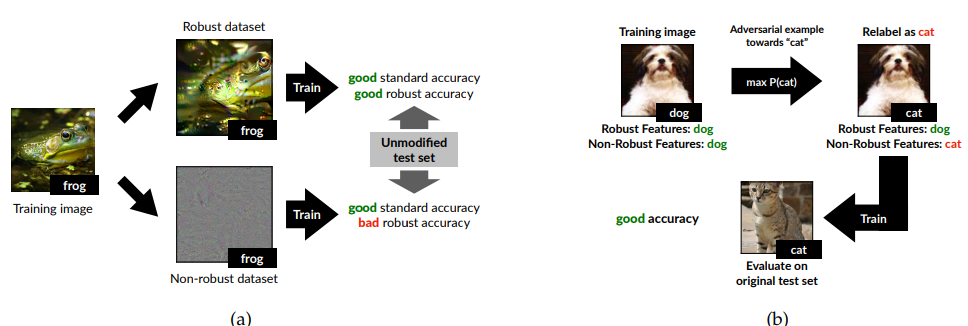

# [Adversarial Examples Are Not Bugs, They Are Features](https://arxiv.org/pdf/1905.02175v2.pdf)

**TL;DR** Dividing features of an image classifier into robust and non-robust helps causally determine effects of adversarial examples.

**Problem**: *Adversarial Examples* are imperceptibly perturbed natural inputs that induce erroneous predictions in state-of-the-art classifiers. Why they exist has been subject of heavy debate, but existing explanations (i.e. aberrations arising either from the high dimensional nature of the input space or statistical fluctuations in the training data) are often unable to fully capture behaviors observed in practice. This paper aims at demystifying adversarial examples.

**Solution**: The main claim of the paper is: *Adversarial vulnerability is a direct result of a models’ sensitivity to well-generalizing features in the data.*

**More details, please?**

* The authors note that some features in images are useful (in that they correlate with the ground truth label, e.g. eyes of a cat being present correlate with the label cat), and some are robust (with respect to adversarial perturbation) - all combinations of usefulness and robustness are thereby possible. 

