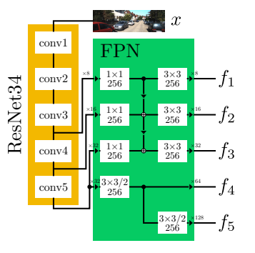

# [Adversarial Examples Are Not Bugs, They Are Features](https://arxiv.org/pdf/1905.02175v2.pdf)

**TL;DR** Dividing features of an image classifier into robust and non-robust helps causally determine effects of adversarial examples.

**Problem**: *Adversarial Examples* are imperceptibly perturbed natural inputs that induce erroneous predictions in state-of-the-art classifiers. Why they exist has been subject of heavy debate, but existing explanations (i.e. aberrations arising either from the high dimensional nature of the input space or statistical fluctuations in the training data) are often unable to fully capture behaviors observed in practice.

**Solution**: The main claim of the paper is: *Adversarial vulnerability is a direct result of a models’ sensitivity to well-generalizing features in the data.*

* Standard approach for 3D object detection: extract features from images using some backbone. Then, use a 2D detection head to derive 2D bounding boxes (4D: center, width and height). Finally, perform 3D object detection using the 2D bounding boxes and the features from the backbone (10D). The below Figures display the backbone, 2D detection head and 3D detection head.

* The authors follow the same approach, their backbone is a ResNet34 with a Feature Pyramid Network (FPN) built on top of it, resulting in features of different scale. The 2D detection head uses a standard [Focal Loss](https://arxiv.org/abs/1708.02002), the 3D detection head a [Huber loss](https://en.wikipedia.org/wiki/Huber_loss).

* A major contribution of this paper is the use of a disentangled loss. Hereby, each semantic contribution to the loss (in the 2D detection head, this would be the center of a bounding box or the dimensions of a bounding box) gets an isolated loss term, while fixing all other contributors to the ground truth (so that they have 0 contribution to the loss at hand).

