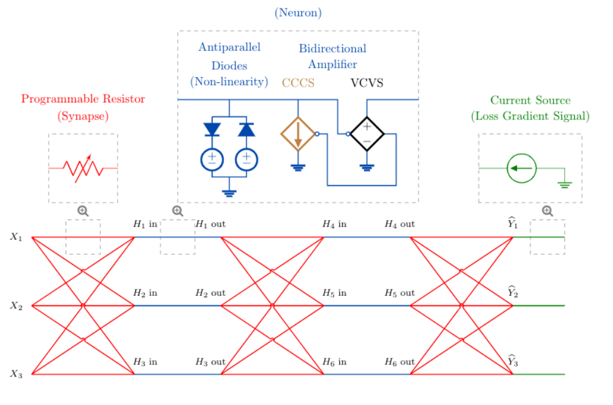

# [Training End-to-End Analog Neural Networks with Equilibrium Propagation](https://arxiv.org/pdf/2006.01981.pdf)

**TL;DR** Train analog neural networks (in this case, nonlinear resistive networks) using diodes as activations and memristors as weights, enabling new generations of AI chips.

**Problem**: The **von Neumann bottleneck** describes the problem arising from the separation of memory and processing in today's deep learning: moving the data back and forth between memory and compute units leads to grave performance degradation. Building fast and energy-efficient neural networks requires a non-von Neumann computing paradigm which unifies memory and processing, by performing neural computations at the physical location of the synapses, where the strength of the connections (the weights of the neural network) are stored and adjusted. 

**Solution**: Essentially, analog neural networks are networks where weights and activations are represented as continuous physical values as opposed to memory representations of floating point numbers.
The authors show that the analog NNs used here (nonlinear resistive networks) are energy-based models as a consequence of [Kirchhoff's laws](https://en.wikipedia.org/wiki/Kirchhoff%27s_circuit_laws#Kirchhoff's_current_law). The update rule for each conductance is local and relies solely on the voltage drop across the corresponding resistor. In simulation, the authors show that this computes the gradient of the loss function.

**Notes**: 

* The computations involved in conventional neural networks consist in large parts of tensor multiplications. A key insight is that the multiply and accumulate
operations of tensor multiplications can be performed in the analog domain by utilizing [Ohm’s law](https://en.wikipedia.org/wiki/Ohm%27s_law) and [Kirchhoff's laws](https://en.wikipedia.org/wiki/Kirchhoff%27s_circuit_laws#Kirchhoff's_current_law), respectively.

* This setup presents significant advantages over multi-processors such as GPUs: the number of
operations that can be simultaneously executed in a GPU is limited by its number of processors; in
contrast, here, [crossbar arrays](https://www.nature.com/articles/s41563-019-0291-x) are used - a crossbar array is a massively-parallel computing device in which all resistors do parallel omputations. Furthermore, since the computation in a crossbar array is in the analog domain, the
power consumption is also several orders of magnitude lower than that of a GPU.

* All the circuit’s dynamics are implemented in a software called [SPICE](https://de.wikipedia.org/wiki/SPICE_(Software)).
